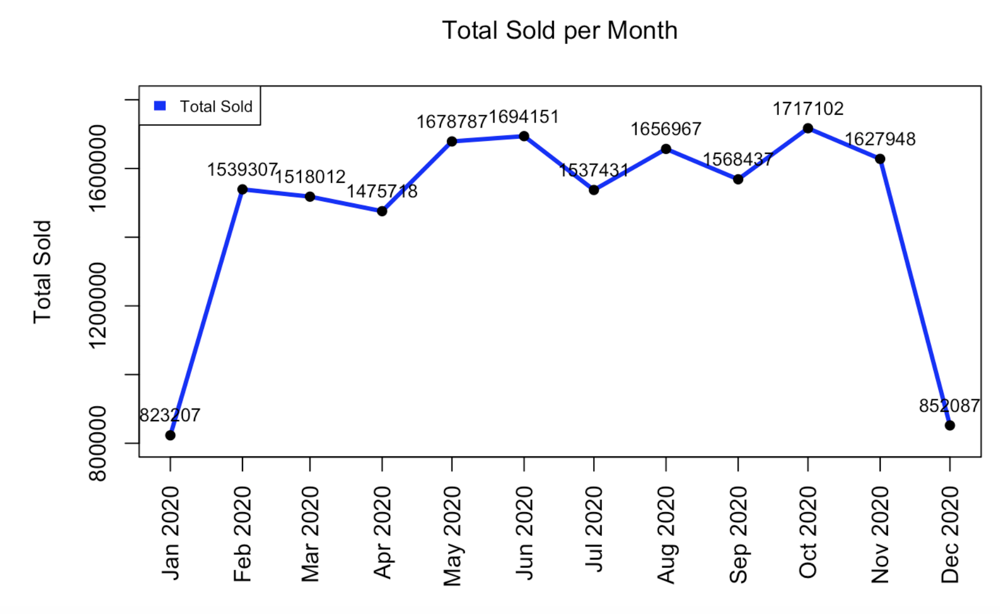

# XML-Data-Mining-and-Analysis
## Overview
This project involved working with XML data, designing and managing relational and analytical databases, and conducting meaningful data mining and analysis. 
In this project, we are given multiple XML sales files including more than 11,000 records of XML data.

#### Part 1: Load XML Data

The main focus of our work was to create a well organized database that follows standard practices for handling online transaction processing (OLTP) and populate it with data from XML documents. 

1. Database Design: A well-structured normalized relational schema was designed, encompassing essential entities such as products, sales reps, customers, and sales transactions.

2. Database Implementation: The designed schema was successfully realized in an SQLite database, demonstrating proficiency in SQL.

3. Data Extraction: XML data from various files was extracted, transformed, and loaded into the SQLite database. A systematic approach was adopted to handle XML files, with special attention to data accuracy.

#### Part 2: Create Star/Snowflake Schema
The second part involved creating an analytical database using a star schema in MySQL. The project excelled in this phase by accomplishing the following:

1. Database Creation: A MySQL database was successfully created and connected to, following best practices for data warehousing.

2. Data Transformation: The normalized schema from Part 1 was transitioned into a de-normalized schema suitable for OLAP. Data from the SQLite database was efficiently migrated into the MySQL analytical database, with a focus on scalability.

3. Fact Table Creation: Two essential fact tables, "product_facts" and "rep_facts," were designed and populated, enabling the execution of complex analytical queries.

#### Part 3: Explore and Mine Data
In this part, data exploration and mining were performed. The project showcased strong analytical and reporting skills with the following accomplishments:

1. Reporting and Visualization: An R Notebook was created to produce a detailed report with markdown. Two critical analytical queries were addressed: 

        Analytical Query I: Identification of the top five sales reps with the most sales, broken down by year.
    
        Analytical Query II: Calculation of the total sales per month, presented through a clear and informative line graph.

2. Data Warehouse Utilization: The project effectively utilized the MySQL data warehouse created in Part 2 to extract valuable insights, showcasing the ability to handle and analyze large datasets.

This project is a comprehensive demonstration of database management, data extraction, transformation, and analysis skills.

